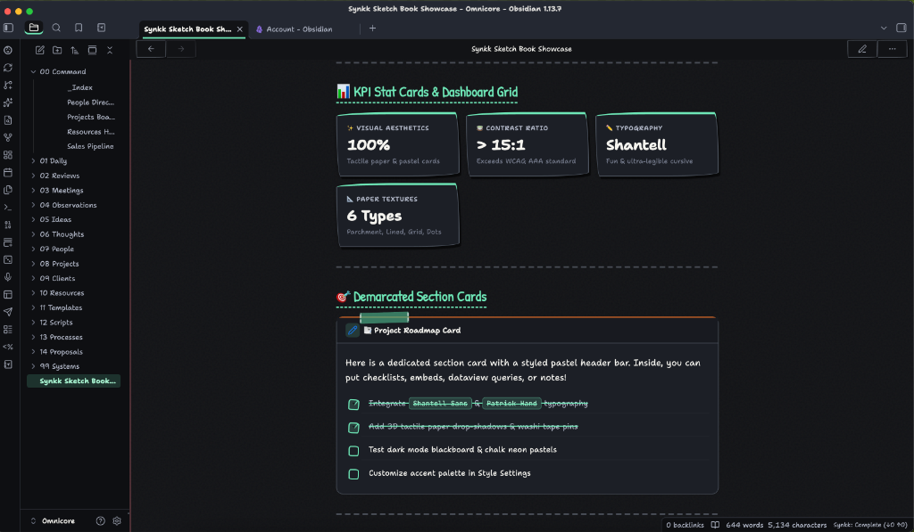
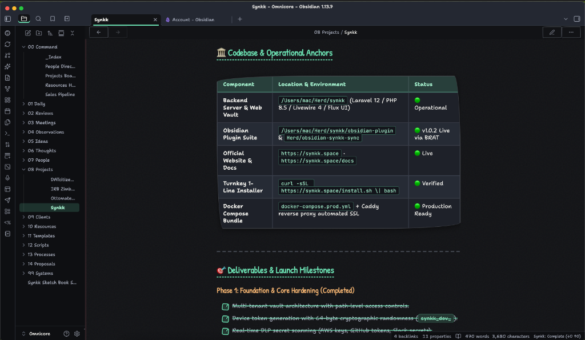
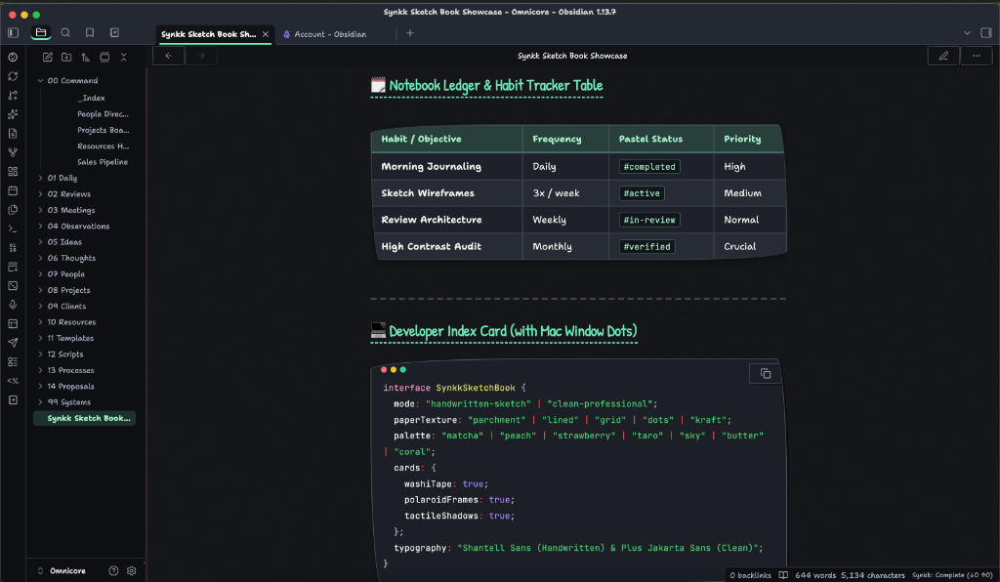
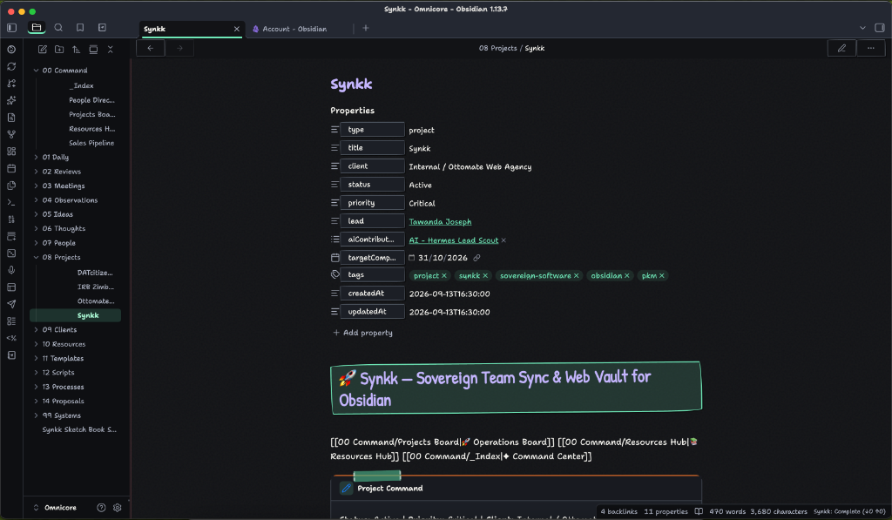
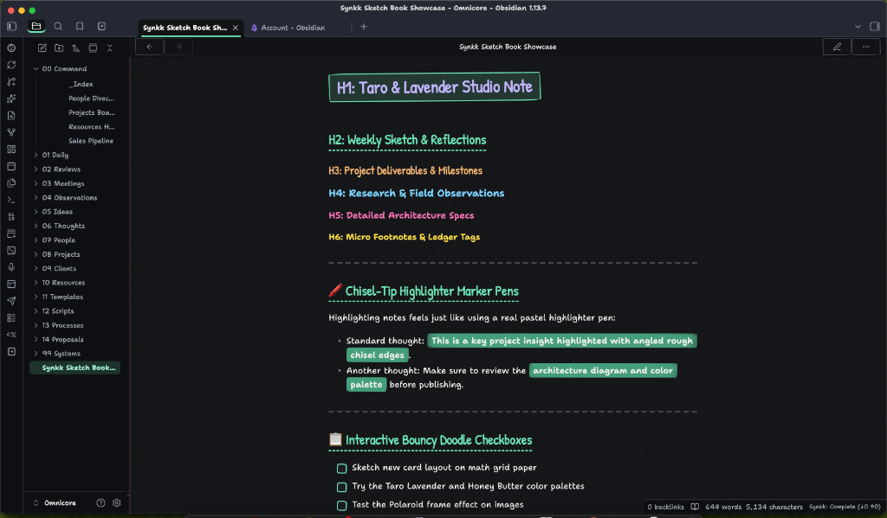

# 📓 Synkk Sketch Book

A tactile, aesthetic pastel sketchbook theme for **[Obsidian](https://obsidian.md)** featuring **deep paper textures**, an **off-white stained background**, **rich Japanese stationery pastel palettes**, **fun visual cards**, and switchable **Handwritten Sketch** vs **Clean & Professional** modes.

Designed for maximum legibility, high contrast (> 15:1 WCAG AAA), and tactile creative warmth.

---

## 📸 Screenshots & Visual Tour

### 1. 📊 KPI Stat Cards & Demarcated Section Cards

### 2. 📑 High-Contrast Tables & Project Milestones (Dark Mode)

### 3. 🗓️ Habit Tracker Tables & Developer Index Cards

### 4. 🗂️ Project Properties & Stationery Cards

### 5. 🖍️ Pastel Headings, Chisel Markers & Doodle Checkboxes

---

## ✨ Key Features

### 1. 🎨 Two Switchable Aesthetic Modes
Switch seamlessly in **Settings → Style Settings → Style & Mode**:
- ✏️ **Handwritten Sketch Mode** *(Default)*:
  - Purpose-built playful and ultra-legible typography: **Shantell Sans** and **Patrick Hand** (with local `Chalkboard SE` and `Noteworthy` fallbacks).
  - Tactile washi tape clips holding cards and sticky notes.
  - Organic wobbly sketch borders and hand-drawn doodle accents.
  - Interactive bouncy doodle checkboxes with custom `✓` marks.
- 💼 **Clean & Professional Mode**:
  - Contemporary editorial typography: **Plus Jakarta Sans** and Apple's **SF Pro**.
  - Sharp modern geometry, clean minimal cards, and crisp borders.
  - Ideal for client presentations, research papers, and corporate documentation.

### 2. 📜 Deep Offline Paper Textures
- 📜 **Off-White Stained Paper** *(Default)*: Antique warm tea-washed cotton canvas with gentle watercolor paper stains.
- 📏 **Ruled Lined Notebook**: Classic notebook horizontal lines with a soft pastel red margin rule on the left.
- 📐 **Dual-Level Engineering Grid**: Math/graph paper with micro-grid and bold primary 5th-line accents.
- ⠸ **Bullet Dot Grid**: Tactile 22px isometric dot matrix.
- 📦 **Warm Kraft Paper**: Organic craft paper tone with fiber depth.
- 📄 **Smooth Fine Paper**: Texture-free clean matte paper.
- 🌑 **Dark Mode Blackboard**: Deep slate graphite paper with subtle chalk dust.
- *100% offline — zero external image downloads or network dependencies.*

### 3. 🍵 Japanese & Korean Pastel Stationery Palettes
- **Light Mode ("Warm Archival Paper")**:
  - Off-white stained canvas (`#faf7f0`) paired with deep walnut sumi ink (`#1d1a18`) guaranteeing **> 15:1 contrast** (exceeds WCAG AAA).
- **Dark Mode ("Charcoal & Blackboard")**:
  - Deep slate paper (`#121316`) with chalk white text (`#f5f4ef`) guaranteeing **> 15:1 contrast**.
  - **High-Contrast Tables**: Perfectly balanced dark slate rows (`#1e2129` odd, `#262b35` even) with razor-sharp chalk white text across every row.
- **7 Vibrant Pastel Presets**:
  - 🍵 *Pastel Matcha & Mint*
  - 🍑 *Pastel Peach & Apricot*
  - 🍓 *Pastel Strawberry & Rose*
  - 🪻 *Pastel Taro & Lavender*
  - 🫧 *Pastel Sky & Periwinkle*
  - 🧈 *Pastel Honey & Butter*
  - 🪸 *Pastel Coral & Melon*
  - *(Plus Custom Color Picker override in Style Settings)*

### 4. 🗂️ Rich Visual Stationery Cards
- **Washi Tape Sticky Notes**: Callouts (`> [!note]`, `> [!tip]`, `> [!warning]`, etc.) render as physical sticky notes with translucent patterned washi tape, dashed torn edges, and 3D paper drop-shadows.
- **Polaroid Photo Cards**: Embedded images display inside Polaroid frames with photo borders, shadows, and top washi tape clips.
- **Developer Index Cards**: Code blocks feature Mac window pastel dots (🔴 🟡 🟢) in the top titlebar.
- **Habit Tracker Tables**: Bullet journal planner tables with rounded corners and alternating rows.
- **Stationery Stickers & Chips**: Tags (`#tag`) and action chips styled as cute stationery sticker labels.

---

## 🚀 Installation

### Option 1: Community Themes (Recommended once approved)
1. Open Obsidian **Settings** (`Cmd + ,` or `Ctrl + ,`).
2. Navigate to **Appearance → Themes → Manage**.
3. Search for **Synkk Sketch Book** and click **Install and use**.

### Option 2: Via BRAT (Beta Reviewers Auto-update Tester)
1. Install the **BRAT** community plugin in Obsidian.
2. In BRAT settings, click **Add Theme for testing**.
3. Enter `tawandajosephmutsena/synkk-sketch-book`.
4. Enable the theme under **Appearance → Themes**.

### Option 3: Manual Installation
1. Download `manifest.json` and `theme.css` from the latest [Release](https://github.com/tawandajosephmutsena/synkk-sketch-book/releases).
2. Inside your Obsidian vault, navigate to `.obsidian/themes/`.
3. Create a folder named `Synkk Sketch Book/` and place `manifest.json` and `theme.css` inside it.
4. In Obsidian, go to **Settings → Appearance → Themes** and select **Synkk Sketch Book**.

---

## ⚙️ Customization with Style Settings

This theme is fully integrated with the **[Style Settings](https://github.com/mgmeyers/obsidian-style-settings)** plugin:
1. Install and enable the **Style Settings** community plugin.
2. Open Obsidian **Settings → Style Settings → Synkk Sketch Book**.
3. Customize:
   - **Aesthetic Mode**: Handwritten Sketch vs Clean & Professional
   - **Paper Texture**: Stained Paper, Ruled Lines, Engineering Grid, Dot Grid, Kraft
   - **Texture Depth**: Slider from subtle to bold
   - **Pastel Palette**: 7 presets or custom color picker
   - **Highlighter Style**: Chisel marker pen, wavy underline, or solid block
   - **Typography & Line Heights**: Custom font overrides and spacing controls

---

## 📄 License

This theme is open-source under the [MIT License](LICENSE).
